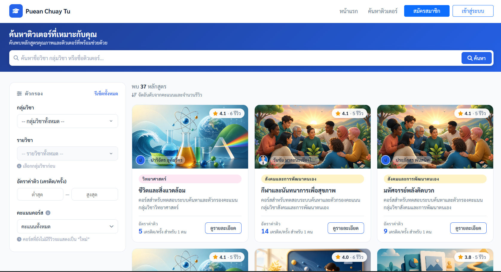
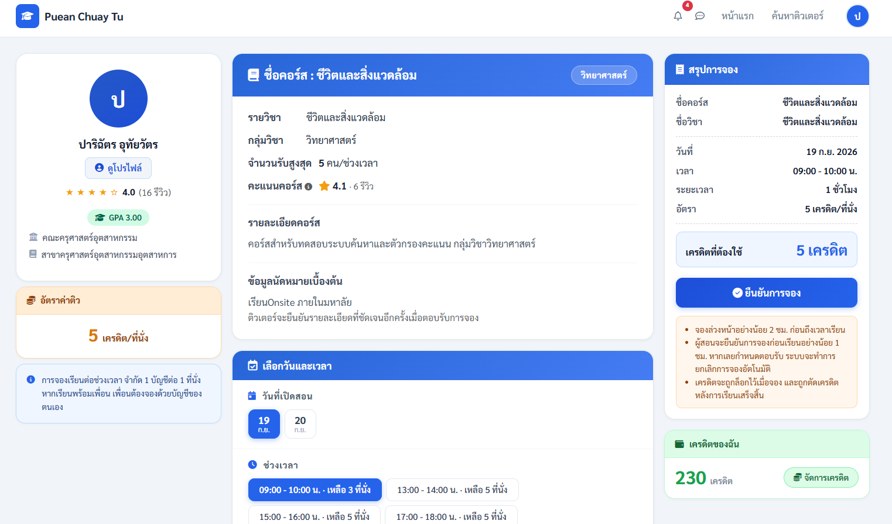
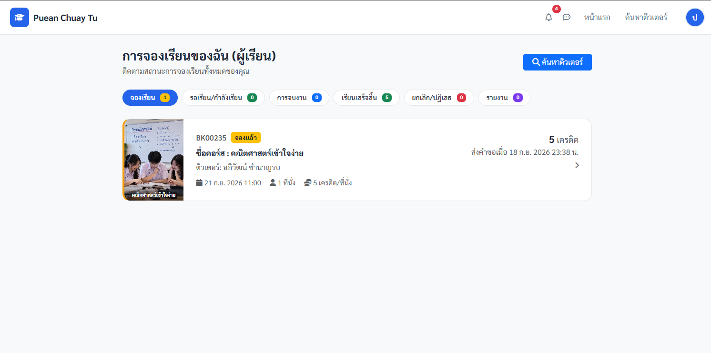
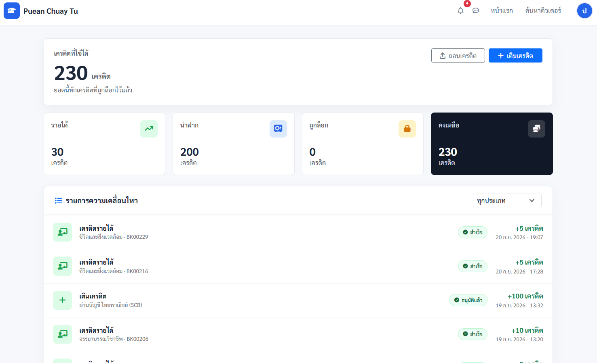
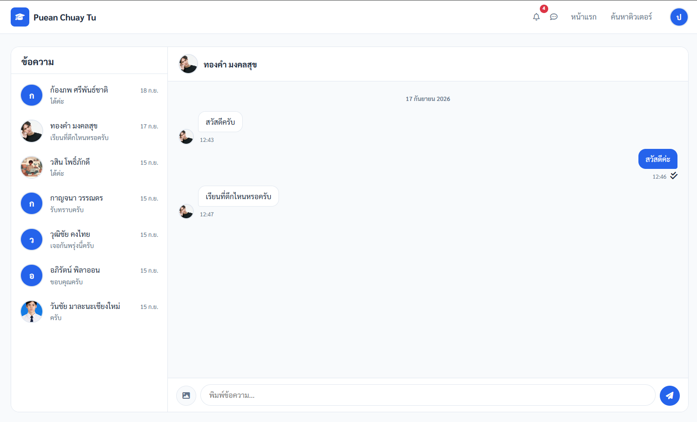
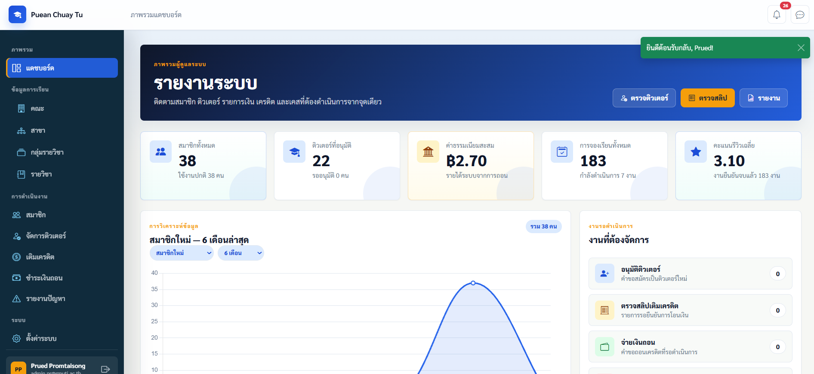

# เพื่อนช่วยติว

เว็บแอปพลิเคชันสำหรับเชื่อมต่อผู้เรียนกับติวเตอร์ภายในมหาวิทยาลัย ครอบคลุมการค้นหาคอร์ส การจองเรียน การส่งหลักฐานการสอน การให้เครดิต การสนทนา และการดูแลระบบ

## About the Project

โครงการนี้พัฒนาขึ้นเพื่อช่วยให้ผู้เรียนค้นหาติวเตอร์และจัดการขั้นตอนการเรียนได้ในระบบเดียว พร้อมสนับสนุนการสมัครเป็นติวเตอร์ การกำหนดตารางสอน การชำระด้วยเครดิต และการติดตามสถานะโดยผู้ดูแลระบบ

## Main Features

- สมัครสมาชิก เข้าสู่ระบบ ยืนยันอีเมล และจัดการโปรไฟล์
- สมัครเป็นติวเตอร์และรอการอนุมัติจากผู้ดูแลระบบ
- เพิ่มคอร์ส กำหนดราคา วันที่ และช่วงเวลาที่เปิดสอน
- ค้นหาติวเตอร์และคอร์สตามข้อมูลรายวิชา
- จองเรียน ตอบรับหรือปฏิเสธการจอง และติดตามสถานะงาน
- บันทึกกิจกรรมและหลักฐานการสอน รวมถึงยืนยันงานเสร็จ
- รีวิวและให้คะแนนติวเตอร์หลังจบการเรียน
- สนทนาและส่งรูปภาพระหว่างผู้ใช้งาน
- เติม ถอน ล็อก และโอนเครดิตตามขั้นตอนของระบบ
- แจ้งเตือนเหตุการณ์สำคัญและรายงานปัญหาการจอง
- จัดการสมาชิก ติวเตอร์ เครดิต รายงาน และค่าระบบผ่านหน้าผู้ดูแลระบบ

## User Roles

- **ผู้เรียน:** ค้นหาและจองคอร์ส สนทนา เติม/ถอนเครดิต ยืนยันการเรียน และรีวิว
- **ติวเตอร์:** สมัครรับสิทธิ์ จัดการคอร์สและตาราง ตอบรับการจอง ส่งหลักฐานการสอน และเติม/ถอนเครดิต
- **ผู้ดูแลระบบ:** อนุมัติติวเตอร์ ดูแลสมาชิก ธุรกรรม รายงาน และการตั้งค่าระบบ

## Tech Stack

- **Backend:** Python, Django
- **Frontend:** Django Templates, HTML, CSS, JavaScript, Bootstrap 5
- **Database:** MySQL
- **Libraries / Tools:** Pillow, NumPy, OpenCV Contrib, qrcode, WeasyPrint, python-dotenv

## Project Structure

```text
apps/
├── accounts/       # สมาชิก การเข้าสู่ระบบ และข้อมูลติวเตอร์
├── admin_panel/    # แดชบอร์ด การอนุมัติ การตั้งค่า และรายงาน
├── bookings/       # การจอง กิจกรรมการสอน การยืนยัน และรีวิว
├── courses/        # คณะ สาขา กลุ่มรายวิชา และรายวิชา
├── credits/        # การเติมและถอนเครดิต
├── messaging/      # ห้องสนทนาและข้อความ
├── notifications/  # การแจ้งเตือนและ signals
└── tutoring/       # คอร์สติวเตอร์ ราคา และตารางสอน
config/             # การตั้งค่าและ URL หลักของ Django
templates/          # Django templates แยกตาม app
static/             # CSS, JavaScript และ public assets
```

## Screenshots

### Home


### Tutor Search


### Course  


### Booking


### Credit Wallet


### Messaging


### Admin Dashboard


## Installation

```bash
git clone https://github.com/methiyada-da/pj_pct.git
cd pj_pct
python -m venv venv
```

เปิดใช้งาน virtual environment:

```powershell
venv\Scripts\Activate.ps1
```

หรือบน macOS/Linux:

```bash
source venv/bin/activate
```

ติดตั้ง dependency:

```bash
pip install -r requirements.txt
```

คัดลอก `.env.example` เป็น `.env` แล้วกำหนดค่าของเครื่องตนเอง จากนั้นสร้างฐานข้อมูล MySQL ให้ตรงกับค่าที่ตั้งไว้

```bash
python manage.py migrate
python manage.py runserver
```

สำหรับการสร้างผู้ดูแลระบบครั้งแรก ให้ตั้ง `ADMIN_SETUP_TOKEN` แล้วเปิด `/panel/setup/?token=<ค่าที่ตั้งไว้>` หลังสร้างผู้ดูแลระบบแล้ว URL นี้จะไม่อนุญาตให้สร้างบัญชีเพิ่ม

## Environment Variables

- `DJANGO_SECRET_KEY`
- `DEBUG`
- `ALLOWED_HOSTS`
- `SKIP_EMAIL_VERIFICATION`
- `DB_NAME`
- `DB_USER`
- `DB_PASSWORD`
- `DB_HOST`
- `DB_PORT`
- `EMAIL_HOST_USER`
- `EMAIL_HOST_PASSWORD`
- `ADMIN_SETUP_TOKEN`
- `SESSION_COOKIE_SECURE`
- `CSRF_COOKIE_SECURE`
- `SECURE_SSL_REDIRECT`
- `SECURE_HSTS_SECONDS`
- `SECURE_HSTS_INCLUDE_SUBDOMAINS`
- `SECURE_HSTS_PRELOAD`

## Testing

โปรเจกต์มีชุดทดสอบสำหรับ workflow หลักใน `bookings`, `admin_panel`, `tutoring` และ `credits`

```bash
python manage.py test
```

คำสั่งนี้จะสร้าง test database ตามการตั้งค่า Django จึงควรใช้บัญชีฐานข้อมูลสำหรับการทดสอบโดยเฉพาะ

## My Responsibilities — Methiyada

- พัฒนาระบบค้นหาติวเตอร์ รายละเอียดคอร์ส การจัดการคอร์ส และตารางเวลาเรียนด้วย Django Forms, Views และ Templates
- พัฒนา booking lifecycle ตั้งแต่การจอง การรับหรือปฏิเสธคำขอ การบันทึกหลักฐานการสอน การยืนยันงาน การรีวิว การยกเลิก และการจัดการข้อพิพาท
- พัฒนาระบบแชทและการแจ้งเตือนสำหรับเหตุการณ์สำคัญของการจอง ติวเตอร์ การเติมเครดิต และการถอนเครดิต
- พัฒนาระบบรีวิวและการจัดอันดับคอร์ส รวมถึง Bayesian weighted rating
- เขียนและดูแล automated tests สำหรับ booking และ tutoring workflows พร้อมปรับ configuration และ security สำหรับเผยแพร่ repository

## Contributors

- **Methiyada** — พัฒนาหลักในส่วน tutor search, course and schedule management, booking lifecycle, teaching evidence, reviews, messaging, notifications และ booking/tutoring tests
- **Matcha** — พัฒนาหลักในส่วน profile และ email workflows, tutor approval, credit top-up/withdrawal, slip and QR processing, admin dashboard, member management, report export และ admin/credit tests
- ทั้งสองคนร่วมพัฒนา authentication, tutor registration, booking-credit integration, database schema และ UI/UX ของระบบ

## Security / Privacy

- ห้าม commit `.env` หรือ credential ทุกชนิด
- ห้าม commit `media/` เพราะเป็นไฟล์อัปโหลดและอาจมีข้อมูลส่วนบุคคล
- ภาพและข้อมูลสำหรับ demo ต้องเป็นข้อมูลจำลองที่ผ่านการตรวจสอบแล้ว
- Production ต้องใช้ `DEBUG=False`, เปิด HTTPS security settings และตั้ง secret ผ่าน environment variables
